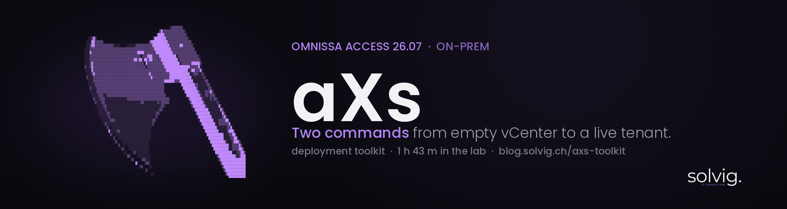
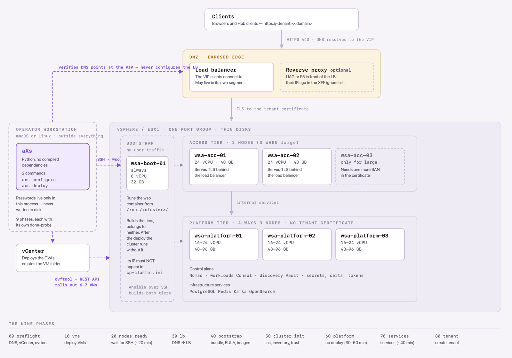
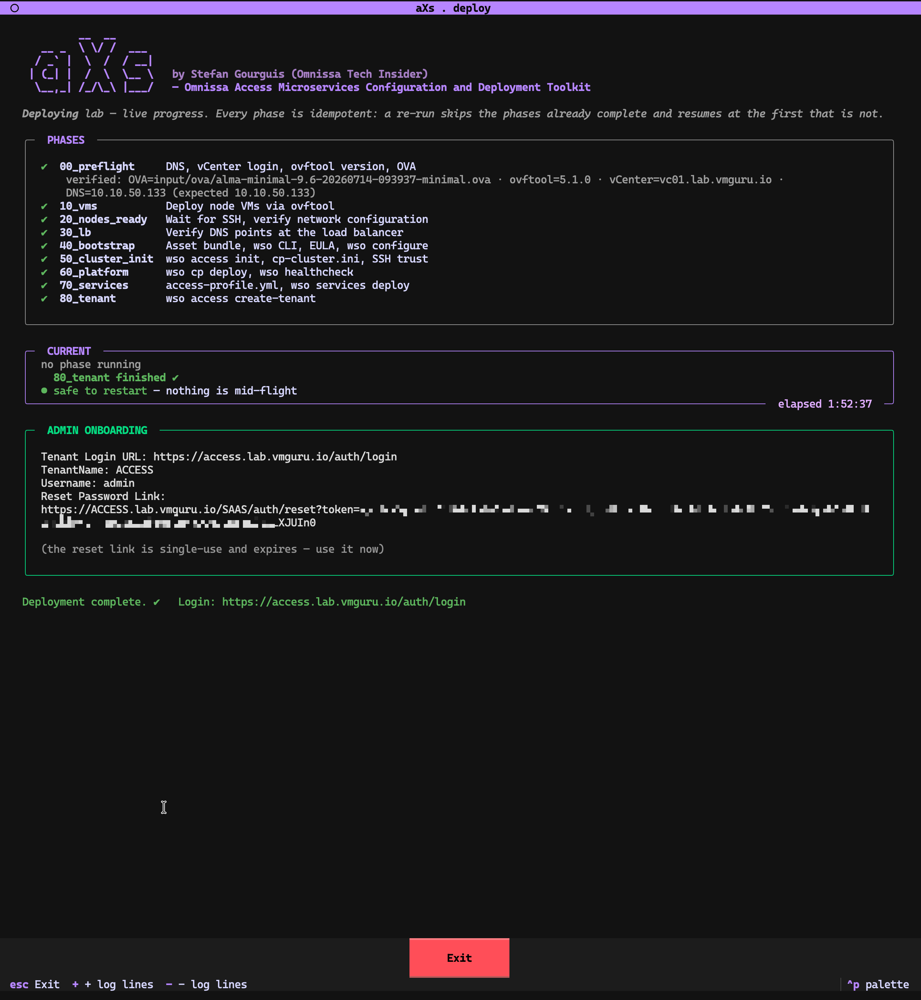
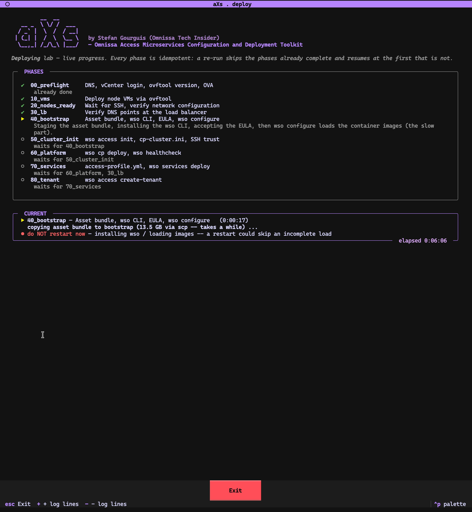
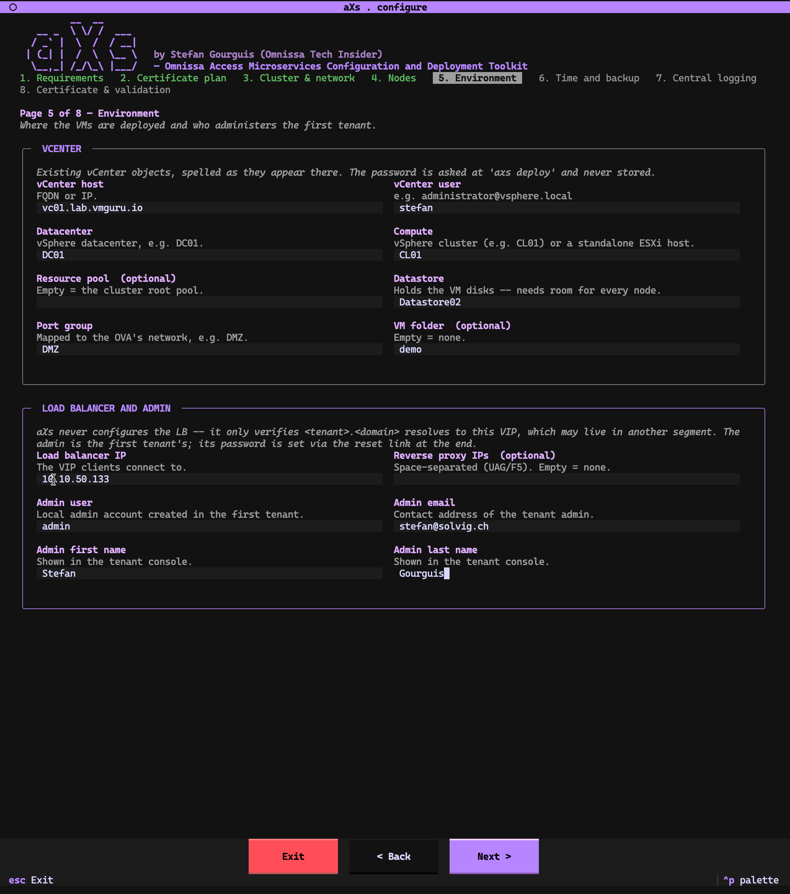

# aXs

**Omnissa Access Microservices Configuration and Deployment Toolkit**
by Stefan Gourguis (Omnissa Tech Insider)

Access 26.07 is no longer an appliance. It is a containerised control plane —
Nomad, Consul and Vault, with PostgreSQL, Redis, Kafka and OpenSearch
underneath — spread across six or seven VMs in three tiers. Good architecture,
considerably more deployment: six chapters of install guide, several steps that
run for 40 minutes, and failures that surface long after their cause.

aXs turns that into two commands. It asks the questions in an order that makes
sense, validates every answer against the others *before* anything is rolled
out, and then runs the documented procedure with live progress.

<picture>
  <source media="(prefers-color-scheme: dark)" srcset="docs/images/architecture-dark.png">
  
</picture>

The tool never enters the cluster. It sits outside and drives vCenter and the
bootstrap node — and the bootstrap, in turn, builds the two tiers and is then
done: no client and no load balancer ever addresses it, and the cluster keeps
running without it.

**It executes Omnissa's procedure — it does not replace it.** Same commands,
same `cp-cluster.ini`, same `access-profile.yml`, same bootstrap, same order.
An environment built this way is indistinguishable from one installed by hand
from the guide, so Omnissa's own upgrade and patch procedures apply to it
unchanged.

## Features at a glance

- **Two commands, empty vCenter to a live tenant** — `axs configure`, then `axs deploy`: nine phases from preflight to a tenant that answers a login.
- **Idempotent and resumable** — every phase probes the live system first; `deploy` skips what is done and resumes at the first thing that is not, `status` runs the same probes read-only. A re-run after a Ctrl-C, a failure or a dropped VPN is the normal case.
- **Validates before it touches anything** — static checks run before the first password prompt; a mis-shaped config stops the run with the cause named and *nothing changed*.
- **Checks that may say "I don't know"** — a dropped connection, a refused login, an unparseable reply and a genuine "no" are four different reports; "we could not ask" is never read as "the answer is no".
- **Detects config drift — and rolls it out** — change `config.yml` after init and aXs patches only the keys you set on the deployed `profile.yml` (semantically, not by text) and applies it on the next `wso cp deploy`.
- **Survives its own connection dropping** — the 30–60-minute `wso` deploys run detached on the bootstrap; restart aXs mid-deploy and it re-attaches instead of launching a second one.
- **Two front ends, one engine** — an interactive live TUI (phase board, credentials form, streaming log) or plain line-by-line text for scripts and `tee`; same phases, same probes, same validation gate.
- **Certificate maths done for you** — the wizard computes the exact SAN coverage your names require and checks your staged PFX against it before anything deploys.
- **Secrets prompted, never stored** — passwords are held in memory only, never written to disk or read from the environment; aXs reads the real configuser expiry and warns before it dies.
- **Runs anywhere Python runs, offline** — pure Python, every dependency a `py3-none-any` wheel: macOS, Linux, WSL2, air-gapped hosts.
- **Executes Omnissa's procedure, does not replace it** — same commands, same files, same order; the result is indistinguishable from a hand-install, so Omnissa's upgrade and patch paths apply unchanged.
- **Tested like it matters** — 561 mutation-checked tests, stdlib `unittest` only.

---

## What makes it different

Not a wrapper script with nicer colours — the differences are in how it
behaves when things are *not* fine.



**It probes before it acts.** Every phase starts by asking the live system
whether its work is already done — the VM that exists, the folder hash that
matches, the tenant that answers. `axs deploy` skips what is complete and
resumes at the first thing that is not; `axs status` runs the same probes
read-only. A re-run after a Ctrl-C, a failure or a lost VPN is the normal
case, not a recovery mode.

**Its checks are allowed to say "I don't know."** The rule the whole tool is
built on: a check must never be friendlier to its input than the system it
vouches for. A dropped connection, a refused login, an unparseable reply and
a genuine "no" are four different reports, never one — and "we could not ask"
is never read as "the answer is no". One concrete consequence: if aXs cannot
tell whether a `wso cp deploy` is already running, it refuses to start one
rather than risk a second deploy against a working cluster.

**It fails loudly or not at all.** Static validation runs before the first
password prompt — a leading colon in `nfs_path`, a half-configured NFS
target, a mis-shaped config all stop the run with the cause named and
*nothing changed*. During the run, a guard around the engine turns any error
into a message on the board plus a trace file — never a frozen screen, never
a raw traceback. The live log drops ovftool's noise (the disk-progress spam,
the base64 certificate dump) but never an error or a warning.

**It survives its own connection dropping.** The long `wso` deploys (30–60
minutes each) run detached on the bootstrap. Restart aXs mid-deploy and it
re-attaches to the running process instead of launching a second one.



**It notices drift — and rolls it out.** Change `config.yml` after the
cluster is initialised and aXs detects the divergence from the deployed
`profile.yml` (semantically, not by text), patches only the keys you set,
records a pending rollout, and applies it with the next `wso cp deploy`. It
knows which settings can be retrofitted and which — central logging — Omnissa
says need a redeployment, and warns instead of pretending. And where the
effect of a retrofit has not been measured on a real cluster, the tool says
exactly that at the moment it matters, instead of showing green.

**Two front ends, one engine.** An interactive terminal gets the live TUI —
phase board, credentials form, streaming log. Piped output or a single-phase
run gets plain line-by-line text for scripts and `tee`. Same phases, same
probes, same validation gate; nothing exists in one path only.

**The certificate maths is done for you.** The wizard computes the exact
coverage your names require — the tenant FQDN, every access node, the
`-cert`/`-amsso` helpers only if the matching feature is on — and checks
your staged PFX against it before anything deploys.



**Secrets are prompted, not stored.** Passwords are asked at the start of a
run, held in memory, and never written to this machine's disk or read from
environment variables (see [Passwords](#passwords) for the honest edge
cases). aXs also reads the real configuser expiry date from the nodes — the
password dies 60 days after the OVA deploy — and warns while there is still
time to act.

**It runs anywhere Python runs, offline.** Pure Python, every dependency
ships as a `py3-none-any` wheel: macOS, Linux, WSL2, air-gapped hosts —
after the one-time setup the tool itself needs no network beyond vCenter and
the nodes.

**Tested like it matters.** 561 tests, stdlib `unittest` only, and the suite
is mutation-checked: each guarded fix is reverted to confirm the tests
actually go red (`tests/README.md` records which revert catches which test).
Generated shell commands are executed through a real `/bin/sh` rather than
inspected as strings, and call sites are tested, not just the helpers they
share.

---

## What aXs does not do

Worth knowing before you start, because these are yours to provide:

- **It never configures the load balancer.** It only verifies that
  `<tenant>.<domain>` resolves to the VIP. The LB must be standing *before*
  the access services deploy.
- **It never creates DNS records.**
- **It never creates vCenter objects** other than the VM folder you configured
  (and the VMs themselves).
- **It never stores a password on your machine.**

---

## Prerequisites

Two kinds: **files you stage**, and **environment that must already exist**.
`axs configure` checks the files live on its first page — including actually
running `ovftool --version` — and will not continue until they are in place.

### Files to stage

Put these under `input/` before you start. The directories already exist.

| What | Where | Get it from |
|---|---|---|
| **ovftool 5.1.0+** | `input/ovftool/` | [Broadcom](https://developer.broadcom.com/tools/open-virtualization-format-ovf-tool/latest) |
| **Node OVA** (AlmaLinux base) | `input/ova/*.ova` | [Omnissa Customer Connect](https://customerconnect.omnissa.com/downloads/info/slug/security_and_compliance/omnissa_workspace_one_access_vidm/26_07) |
| **Access asset bundle 26.07** | `input/assets/*.zip` | same download page |
| **TLS certificate** (PKCS#12) | `input/certs/*.pfx` | your own CA or provider |

**ovftool is extracted, not installed.** Unpack the Broadcom download so that
`input/ovftool/ovftool` is the runnable binary *with its runtime next to it*
(`lib/`, `schemas/`, `env/`, `icudt44l.dat`) — not just the binary, not the
`.zip`. Make it executable (`chmod +x input/ovftool/ovftool`), and use the
build for the machine that runs aXs. Version 5.1.0 is the floor: 4.6.3 fails
against ESXi 8.0.3 at 99% of the upload.

**The certificate must cover every name the cluster serves TLS on** — the
tenant FQDN and each access node's FQDN — either by its own SAN entry or by a
wildcard covering one level. Two more SANs are needed only if you enable the
matching feature: `<tenant>-cert.<domain>` for certificate-based auth and
`<tenant>-amsso.<domain>` for Mobile SSO. The *Certificate plan* page in
`axs configure` prints the exact list for your names, and can check a staged
PFX against it before you deploy anything.

### Environment that must exist

aXs cannot create these for you:

- **vSphere / ESXi** with capacity for the cluster: 6 VMs for `small` and
  `medium`, 7 for `large`. The bootstrap is always 8 vCPU / 32 GB; access
  nodes range from 24 vCPU / 48 GB (small) to 64 / 96 (large).
- **vCenter** reachable, with an account allowed to deploy OVAs. Datacenter,
  compute cluster, datastore and the VM port group ready.
- **Static IPs** and gateway/netmask for every node, node FQDNs in DNS.
- **`<tenant>.<domain>` resolving to the load balancer IP.**
- **A load balancer** in front of the access nodes, standing *before* the
  deploy — `access-profile.yml` needs its IP and the certificate.
- **A configuser password**, identical on all nodes. It **expires 60 days
  after the OVA deployment**, so deploy inside that window.

> **Disk:** the OVA always ships a 200 GB disk, but the install guide wants
> 300 GB for `medium` and 400 GB for `large` on the infrastructure nodes.
> Expand it after deployment — the OVA cannot.

### Operator machine

**macOS or Linux**, with `ssh`, `scp` and `openssl` (present by default on
both). Nothing else: aXs is pure Python with no compiled dependencies, so it
also works on air-gapped hosts once set up.

**Windows: use WSL2.** aXs runs inside WSL2 exactly as on any Linux host. It does
**not** run under native Windows Python — the password-based SSH path relies on
Unix `pty` and the cluster lock on `fcntl`, neither of which exists there, so it
fails at import. Under WSL2 all of that works; two practical notes: install the
**Linux** ovftool (not the Windows `.exe`), and make sure WSL2 can reach vCenter
and the node network — its default NAT may need mirrored networking (Windows 11
23H2+) or a route on the host for a private VLAN.

---

## Install

```bash
git clone git@github.com:vmmachina/aXs.git
cd aXs
./axs configure -c lab
```

That is the whole installation. On first use the launcher runs
`scripts/setup.sh`, which needs internet **once** and:

1. fetches [uv](https://astral.sh/uv) (via Homebrew if present, otherwise the
   official installer),
2. lets uv download a suitable Python interpreter — **no system Python
   required**,
3. installs all dependencies into `.venv`.

Afterwards everything runs from `.venv` with no further network access needed
by the tool itself. To do the setup deliberately rather than on first run:

```bash
./scripts/setup.sh
```

---

## Use

```bash
./axs configure -c lab     # guided dialog -> clusters/lab/config.yml
./axs deploy    -c lab     # run every phase that is not already complete
./axs status    -c lab     # probe the live state of every phase
./axs validate  -c lab     # static config checks, no network
./axs phases               # list the phases and their dependencies
```

`-c` names the **local** folder under `clusters/`. It is a different thing from
`cluster.name` in the dialog, which names the working directory `/root/<name>`
on the bootstrap node; the two may differ.

**Configure** walks eight pages: requirements, certificate plan, cluster and
network, nodes, environment, two optional pages for operational settings, and a
final page that opens your PFX and validates everything together — hostnames
and IPs against each other, the certificate's names against the real tenant and
node FQDNs, vCenter reachability, and DNS against the load balancer. Nothing is
written until you have seen that result.

**Deploy** asks for the vCenter and configuser passwords, then runs unattended
for roughly one to two hours. Every phase is idempotent: a re-run skips what is
already complete and resumes at the first thing that is not. A timestamped
record is written to `clusters/<name>/deploy.log`.

At the end you get the tenant login URL, the admin username, and the
reset-password link — the only way to set the first admin password. The link is
single-use, expires, and is deliberately never written to the log.

---

## The nine phases

| Phase | What it does | Depends on |
|---|---|---|
| `00_preflight` | DNS, vCenter login, ovftool version, OVA | — |
| `10_vms` | Deploys the node VMs via ovftool | 00 |
| `20_nodes_ready` | Waits for SSH, verifies each node's network config | 10 |
| `30_lb` | Verifies DNS points at the load balancer | 00 |
| `40_bootstrap` | Asset bundle, wso CLI, EULA, `wso configure` | 20 |
| `50_cluster_init` | `wso access init`, inventory, SSH trust | 40 |
| `60_platform` | `wso cp deploy` (~30–60 min), healthcheck | 50 |
| `70_services` | `access-profile.yml`, `wso services deploy` (~40 min) | 60, 30 |
| `80_tenant` | `wso access create-tenant` | 70 |

`30_lb` depends only on preflight rather than on the nodes, because it verifies
something the customer provides rather than something aXs builds. Phases still
execute in the order listed above -- one at a time, never concurrently -- so in
practice the DNS check runs after the nodes are up, and asks the bootstrap
itself: split-horizon DNS answers by the client's source IP, so the operator's
laptop is the wrong place to ask (docs/08 B6). It must be done before
`70_services`, which needs the LB IP and the certificate.

---

## Optional: operational settings

`wso access init` writes a `profile.yml` holding NTP, an NFS backup target,
central logging and the Nomad bridge subnet. All of it is optional — a
deployment without any of it is perfectly regular — but two of them are worth a
decision, in Omnissa's own words:

- **NTP** — *"For production deployments, NTP server is highly recommended to
  prevent time drift."* Access is an identity provider: drifting clocks break
  SAML assertion windows and TOTP codes intermittently, on whichever node
  happens to answer.
- **NFS** — *"For production deployments, NFS is required for disaster
  recovery."*
- **Central logging** is the one setting with a deadline: changing it after the
  first deployment *"would require a full redeployment/upgrade of the cluster to
  take effect."*

aXs offers these in the dialog and patches only the keys you set, leaving the
rest of the vendor's file untouched. If you configure an NFS target, it is
mounted from the bootstrap and write-tested before the deploy continues — a
backup target that only fails at restore time is the worst way to find out.

> **Optional is not the same as harmless.** Leaving these unset costs you
> nothing: the deploy runs, and `wso cp precheck` notes the absence and carries
> on. But a value that is *set and wrong* is expensive — an NFS target the
> cluster cannot mount aborts `70_services` within seconds, after the hour the
> platform tier already took. Set them deliberately or not at all.
>
> One trap in particular: the vendor's example writes `nfs_path` with a
> **leading colon** (`:/controlplanenfs/us04pA`). Do not copy it. wso prepends a
> colon of its own, and the doubled `::` asks for an export that does not exist.
> Write the path plainly — `/controlplanenfs/us04pA`.

---

## Example: retrofitting a backup target

The cluster is already live. You now want an NFS backup target and an NTP server
the first deploy did not have. Re-run `axs configure` and fill them in on the
operational-settings page — the wizard validates each field and writes them into
`config.yml` for you (editing the file by hand works too, but is not required):

```yaml
deployment_settings:
  ntp_server:  ch.pool.ntp.org
  nfs_host:    10.10.225.60
  nfs_path:    /srv/cpbackup
  nfs_version: "3"
```

`axs status` reads the *live* cluster and sees the divergence — it never just
trusts that a past deploy is still current:

```
50_cluster_init  OPEN  config.yml and the bootstrap's profile.yml disagree on
                       4 key(s). This phase will rewrite profile.yml and phase
                       60 will roll the change out
...
80_tenant        DONE  tenant created ✓ | https://…/auth/login -> HTTP 200
```

`axs deploy` then patches only those four keys into the deployed `profile.yml`,
records a pending rollout, and applies it with the next `wso cp deploy`. The
finished phases before it are skipped and the tenant is never rebuilt. Verified
end-to-end on a live lab cluster: the retrofitted NFS target lands in
`profile.yml` and mounts on the platform nodes — the divergence is detected
semantically (not by comparing text), so only what genuinely changed is written.

---

## Passwords

The vCenter and configuser passwords — and any logging backend password — are
asked at the start of a run, held in memory for that run only, and gone when it
ends. They are never written to this machine's disk and never read from
environment variables. Secrets are masked in the console and in `deploy.log`.

Where they do leave the process, all stated on the credentials screen:

- **ovftool** takes them on its local command line during phase 10 — 5.x offers
  no stdin, so this one is unavoidable.
- **The vendor's own file formats** want plain text *on the bootstrap*:
  `cp-cluster.ini` when `cluster.auth` is `password`, and `profile.yml` for a
  logging backend. That is Omnissa's format, not our choice.
- **Getting them there** currently passes the file content through a remote
  command line, so it is briefly visible in `ps` on both machines. Unlike the
  two above this one is ours to fix — moving it to stdin is on the roadmap.

---

## Layout

```
axs / ws1access      launchers (run setup on first use)
input/               what you stage: ovftool, OVA, asset bundle, certificate
clusters/<name>/     per-deployment config.yml, extracted certs, deploy.log
src/ws1access/       the tool
  phases/            one module per phase, each with its own done-probe
reference/           vendor file formats, captured from real runs
docs/images/         diagrams and screenshots used in this README
```

`clusters/` and `input/` are gitignored — they hold your configuration,
certificates and multi-gigabyte downloads.

---

## Status

Built and proven against Omnissa Access 26.07 in a lab: empty vCenter to a live
tenant in **1 hour 43 minutes**. The [blog post and walkthrough videos](#links)
cover the architecture decisions and the findings behind them — including the
things that only a real run teaches.

---

## Links

**Guide**

- [aXs — the full step-by-step deployment guide](https://blog.solvig.ch/axs-guide/)
  — from staging the files to a live tenant, walked through end to end.

**Watch it run**

- [aXs — Configure Omnissa Access 26.07 for Deployment (Part 1)](https://youtu.be/BkQrl_6XUNg)
- [aXs — Deploy Omnissa Access 26.07 in One Command (Part 2)](https://youtu.be/lhQKqT1YNPU)

**Background**

- [Omnissa Access 26.07: from OVA to tenant in under two hours](https://blog.solvig.ch/axs-toolkit/)
  — what the release changes and why this toolkit exists.
- [Workspace ONE Access 26.07 release notes](https://docs.omnissa.com/bundle/workspace-one-access-release-notesV26.07/page/workspace-one-access-release-notes.html)
  — the vendor documentation aXs follows. It is the authority; where the two
  ever disagree, the documentation wins.

**Author**

- [Stefan Gourguis on LinkedIn](https://www.linkedin.com/in/stefan-gourguis-1ab6a570/)
- [Stefan Gourguis in the Omnissa Community](https://community.omnissa.com/profile/30467-stefaneuc/)
- [solvig. IT Consulting](https://solvig.ch) — the consultancy behind aXs.

---

## Version history

**1.0 — Initial release**
First public release. Nine-phase deploy engine for Omnissa Access 26.07
(preflight → tenant), interactive TUI and plain-text front ends over one
engine, semantic config-drift detection with rollout, certificate coverage
cross-check, passwords held in memory only, offline `py3-none-any` install for
macOS / Linux / WSL2, and a mutation-checked test suite (561 tests). Built and
proven end-to-end against a real lab cluster: empty vCenter to a live tenant in
1 hour 43 minutes.

---

## Licence

MIT — see [LICENSE](LICENSE). Use it, fork it, adapt it, ship it in your own
consulting work; the only condition is that the copyright notice travels with
it.

aXs executes Omnissa's documented procedure and is not affiliated with,
endorsed by, or supported by Omnissa. Omnissa Access itself, its container
images and its documentation remain under Omnissa's own terms — this licence
covers only the toolkit in this repository.

---

<p align="center">
  <a href="https://solvig.ch"></a>
</p>
